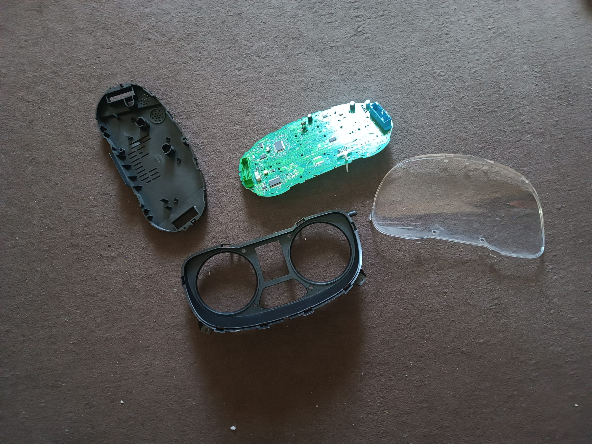
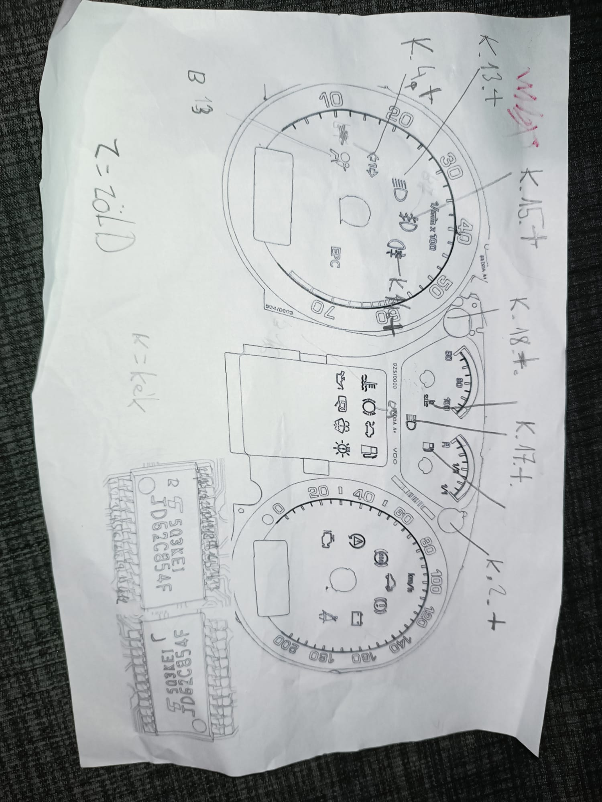
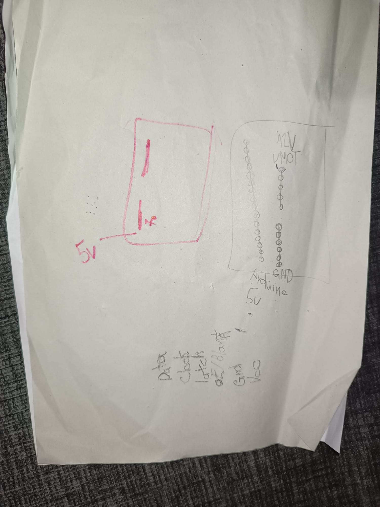
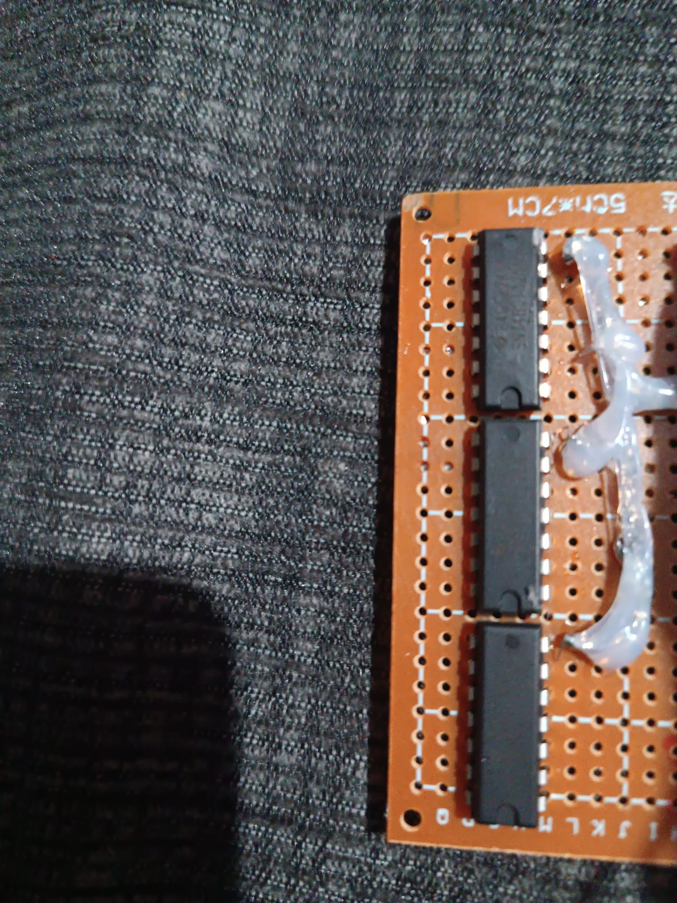
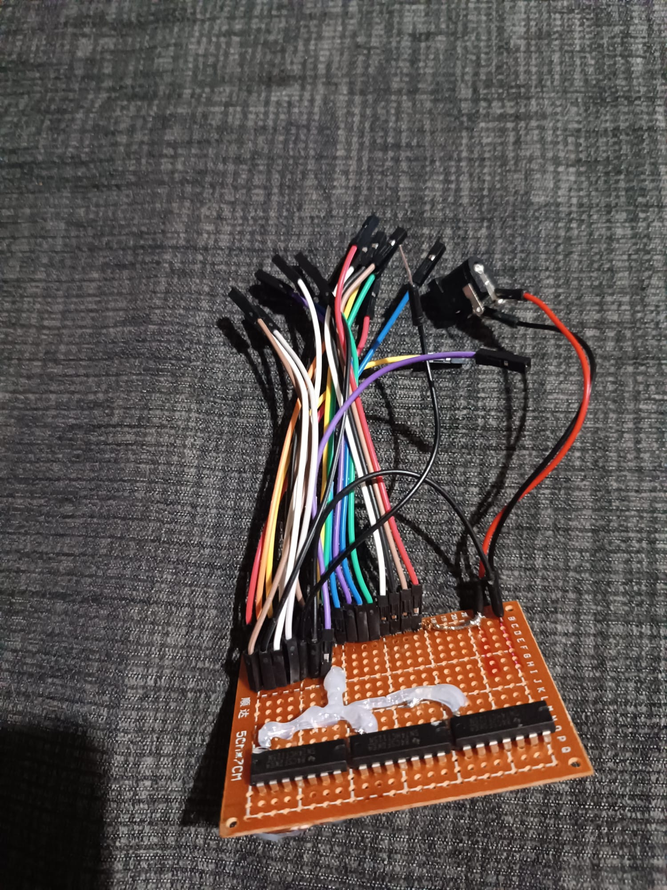
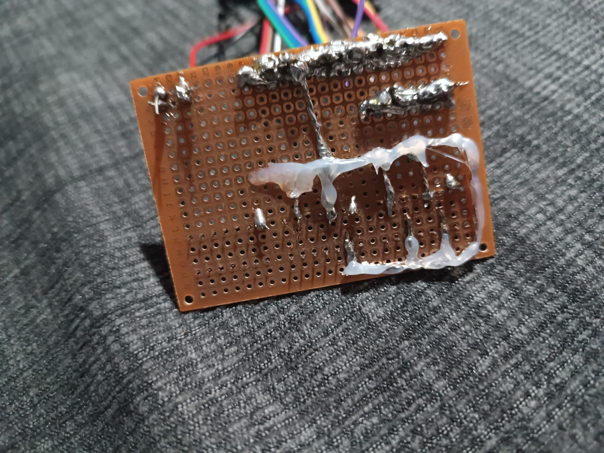
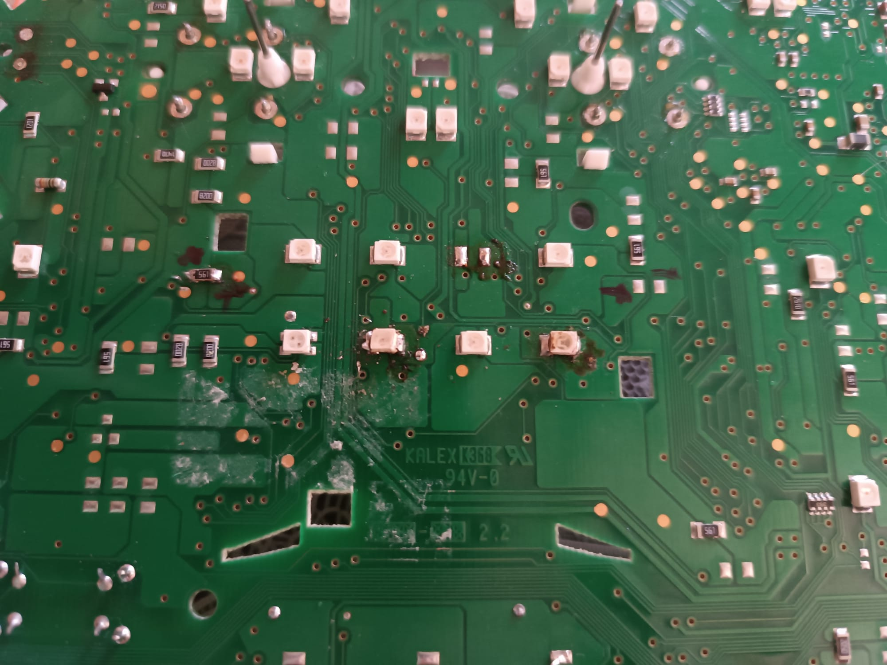

# Octavia-1-Dashboard

A dashboard project.

## 📋 Project Overview

This is the Octavia-1 Dashboard - a comprehensive dashboard solution designed to use for pc simulators.
I have significantly expanded the scope of this project into a multi-phase hardware and software engineering build. I am converting a physical Skoda Octavia MK1 instrument cluster into a high-fidelity, real-time PC flight/racing simulator telemetry display.

## Current Progress (20 Hours Logged):

Hardware Reverse Engineering: Analyzed the internal trace lines, power rail limits, and motor pinouts of a replacement cluster following a previous hardware       failure (which was an excellent learning experience).
Interface Board Fabrication: Built a fully functional hardware interface on a 5x7cm barna perfboard, permanently soldering 3 driver ICs to safely handle logic     signal conversions between the microcontroller and the dashboard.
Complex Wire Harnessing: Engineered a point-to-point jumper wire harness to break out the connections. Applied hot-melt adhesive to insulate exposed solder        joints and provide mechanical strain relief.

## Remaining Scope:

Firmware Development: Writing custom python code using tkinter to simulate how it should work
Custom PCB Shield Design: Try to create a pcb for it.

## Diary

### 1st log (3.5 hours)
Analyzed the internal board layout of the replacement cluster. Traced the circuit lines to find the correct entry points for the stepper motors and indicators to avoid another hardware failure.
  ### Disassembly
  

  ### LEDS
  

  ### Pinout

## 2nd log (4 hours)
Mapped out the component placement on the 5x7cm barna perfboard. Positioned the three driver ICs and the male headers, then permanently soldered them onto the prototype board.

  ### ICs
  

## 3rd log (4.5 hours)
Started building the complex point-to-point jumper wire harness. Stripped, routed, and soldered individual wires from the IC legs to the breakout headers to safely transfer signals.

  ### Wires
  

## 4th log (4 hours)
Used a multimeter to test continuity on every single soldered connection. Checked for accidental solder bridges between the IC pins to prevent any short circuits before testing on live power.
 
  ### Checking
  

## 5th log (4 hours)
Completed the hardware prototyping phase. Applied layers of hot-melt adhesive over the wire cluster to insulate the exposed solder joints and provide mechanical strain relief against loose connections.

  ### Coating
  

## 6th log (5 hours)
Completed a simulation python code that shows how it will work.

  ### Python screenshot
  

  ## DEMO LINK: https://youtu.be/50QhlQHXBYw

  ## 7th log(2.5 hours)
  Started mapping out the pcb so i can recreate it later, added 1more led to the prototype, tried to add 2more but they burned out
  
  
  
**Last Updated:** August 3, 2026
